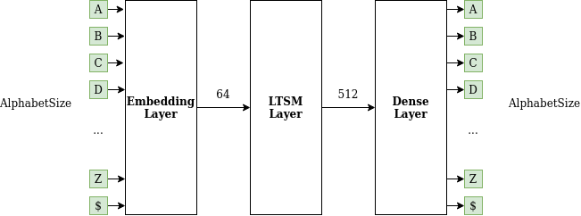
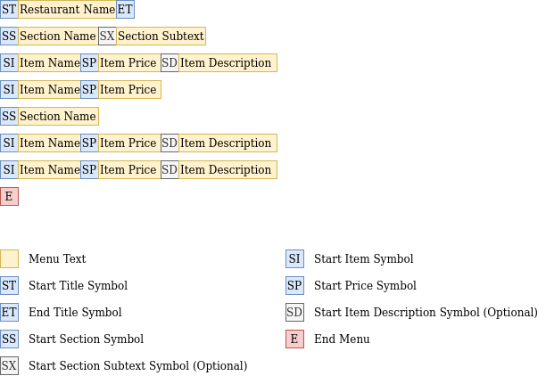
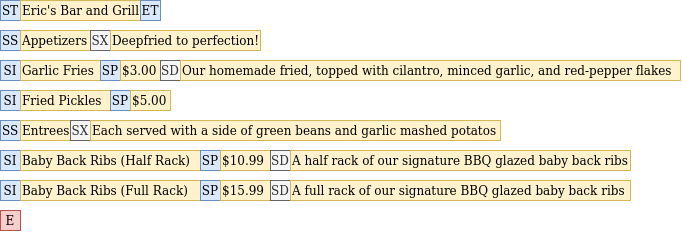

# BurgerNET
AI generated restaurant menus!


## Network design

BurgerNET is a simple LTSM based recurrent nerual network that processes and generates restaurant menus as a sequence of symbols.



The size of the input / output vectors depends on the alphabet used in the training data.

A restaurant menu is composed of the following
* A title
* One or more sections, each of which contains the following properties:
    * A section title
    * A section subtitle (optional)
    * One or more items, each of which contains the following properties:
        * A name
        * A price
        * A description (Optional)

Because the network operates on a sequence of symbols, a series of special "delimiter" symbols are used to
indicate the boundary between sections and items.



Below is a sample menu input for training, encoded in json
```
{
    "name": "Eric's Bar and Grill",
    "sections": [
        {
            "title": "Appetizers",
            "subtitle": "Deepfried to perfection!",
            "items": [
                {
                    "name": "Garlic Fries",
                    "price": "$3.00",
                    "description": "Our homemade fried, topped with cilantro, minced garlic, and red-pepper flakes"
                },
                {
                    "name": "Fried Pickles",
                    "price": "$5.00"
                }
            ]
        },
        {
            "title": "Entrees",
            "subtitle": "Each served with a side of green beans and garlic mashed potatos",
            "items": [
                {
                    "name": "Baby Back Ribs (Half Rack)",
                    "price": "$10.99",
                    "description": "A half rack of our signature BBQ glazed baby back ribs"
                },
                {
                    "name": "Baby Back Ribs (Full Rack)",
                    "price": "$15.99",
                    "description": "A full rack of our signature BBQ glazed baby back ribs"
                }
            ]
        }
    ]
}
```

The same menu is parsed and converted into the following string of symbols before being input into the network



## Dependencies

**NOTE:** You must have the following software installed to train or run the network
 - Docker
 - Nvidia drivers
 - Nvidia container runtime


All other dependencies are contained in a docker image. To train/run the network, run the following command to
build and start the docker image:
```
./env.sh
```


## Training

To train the network, first collect some restaurant menus, encode them according to the specified JSON format, and store
them into a directory. The structure or naming of the files doesn't matter: The training script will recursively look for all
files ending with `.json` in the training data directory.

Inside the docker container started earlier, run the following command to train a new network for 20 epochs:
```
./burger.py --train <input_directory> --epochs 20
```

## Inferencing

To generate a new restaurant menu using a trained network, run the following command inside the docker container started earlier:
```
/burger.py --generate <restaurant name>
```
